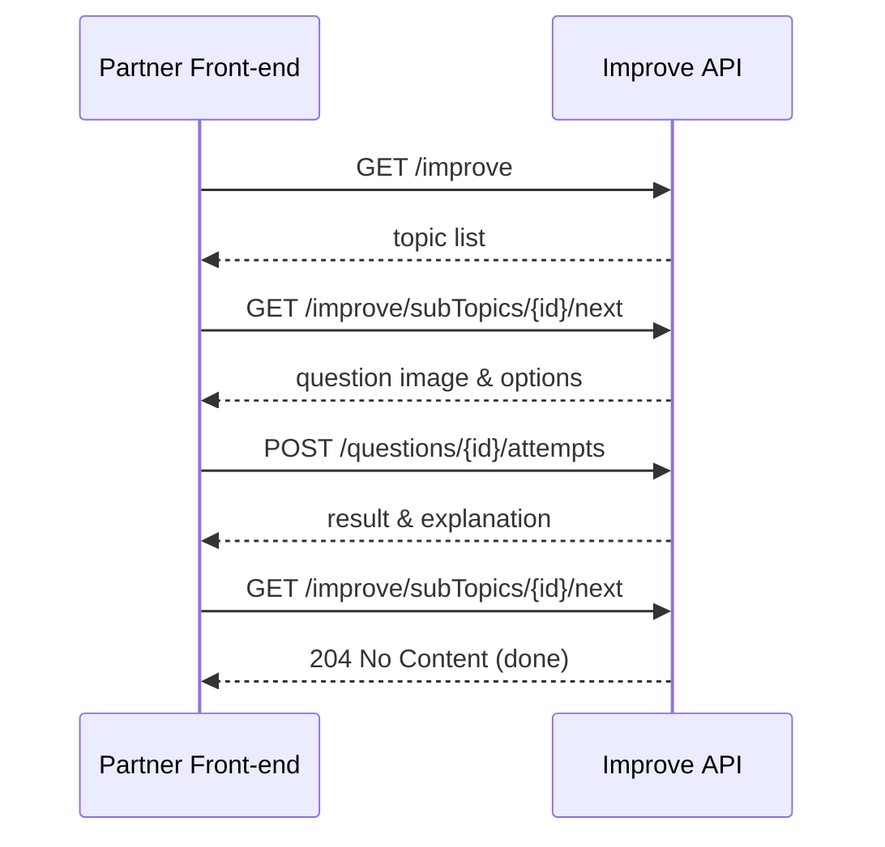

# Improve API – Technical Specification

**Version:** 1.0  
**Date:** 14‑05‑2025  

## Table of Contents
1. [Purpose & Scope](#purpose-scope)  
2. [Context & Terminology](#context-terminology)  
3. [User Flows](#user-flows)  
4. [API Contract](#4api-contract)  
   * 4.1 [List misconceptions](#list-misconceptions)  
   * 4.2 [Get next question](#get-next-question)  
   * 4.3 [Submit attempt](#submit-attempt)    
5. [Data Model](#data-model)  
6. [Business Rules](#business-rules)  
7. [Error Handling](#error-handling)  
8. [Assumptions](#assumption)  
9. [Appendix](#appendix)  

---
<a id="purpose-scope"></a>
## 1  Purpose & Scope
Provide third‑party education partners with REST endpoints that let a student:  
* List the maths topics & sub‑topics where they currently hold **misconceptions** (incorrect or unanswered questions).  
* Re‑attempt those questions, receive instant feedback, and update their record.  

---
<a id="context-terminology"></a>
## 2  Context & Terminology

| Term | Definition |
|------|------------|
| **Topic / Sub‑topic** | Curriculum hierarchy e.g. *Number → Fractions*. |
| **Question** | Image‑based item, single correct option A‑D. |
| **Attempt** | One answer submission by a student. |
| **Misconception** | A question whose **latest** attempt by a student is incorrect. |

---
<a id="user-flows"></a>
## 3  User Flows

1. **List misconceptions**  
   Student lands on Improve list → sees sub‑topics grouped under topics, each with a count.  
2. **Answer a question**  
   Student selects a sub‑topic → front‑end fetches first pending question → student answers → API returns correctness & explanation → UI shows feedback.  
3. **Completion**  
   When no misconceptions remain in a sub‑topic, it disappears from the list; when all sub‑topics clear, the list page shows a completion state.

---
<a id="api-contract"></a>
## 4  API Contract

Base URL: `/v1`
<a id="list-misconceptions"></a>
### 4.1 List misconceptions

`GET /students/{studentId}/improve`

```json
{
  "studentId": "stu_123",
  "topics": [
    {
      "topicId": "t1",
      "name": "Number",
      "subTopics": [
        { "subTopicId": "st1", "name": "Fractions",  "misconceptions": 4 },
        { "subTopicId": "st2", "name": "Decimals",   "misconceptions": 2 }
      ]
    }
  ]
}
```

Returns only sub‑topics where `misconceptions > 0`.
<a id="get-next-question"></a>
### 4.2 Get next question

`GET /students/{studentId}/improve/subTopics/{subTopicId}/next`

*200 OK*

```json
{
  "questionId": "q_987",
  "imageUrl": "https://eedi.com/questions/q_987.png",
  "options": ["A", "B", "C", "D"]
}
```

*204 No Content* – student has cleared this sub‑topic.
<a id="submit-attempt"></a>
### 4.3 Submit attempt

`POST /students/{studentId}/questions/{questionId}/attempts`

```json
{ "selectedOption": "A" }
```

*201 Created*

```json
{
  "attemptId": "att_555",
  "isCorrect": false,
  "explanation": "I think you counted down rather than up. Try a number line.",
  "correctOption": "C"
}
```
---
<a id="data-model"></a>
## 5  Data Model (with types & notes)

| Table       | Field            | Type                     | Notes                                                   |
|-------------|------------------|--------------------------|---------------------------------------------------------|
| **Topic**   | `topicId`        | `UUID` **PK**            | Stable across curriculum versions                       |
|             | `name`           | `VARCHAR(120)`           | e.g. “Number”                                           |
| **SubTopic**| `subTopicId`     | `UUID` **PK**            |                                                         |
|             | `topicId`        | `UUID` **FK → Topic**    |                                                         |
|             | `name`           | `VARCHAR(120)`           | e.g. “Fractions”                                        |
| **Question**| `questionId`     | `UUID` **PK**            |                                                         |
|             | `subTopicId`     | `UUID` **FK → SubTopic** |                                                         |
|             | `imageUrl`       | `TEXT`                   | CDN URL; pre‑rendered PNG                               |
|             | `correctOption`  | `CHAR(1)`                | ‘A’–‘D’                                                 |
|             | `explanations`   | `JSONB`                  |                       |
| **Attempt** | `attemptId`      | `UUID` **PK**            |                                                         |
|             | `studentId`      | `UUID`                   | Supplied by auth layer                                  |
|             | `questionId`     | `UUID` **FK → Question** |                                                         |
|             | `selectedOption` | `CHAR(1)`                | ‘A’–‘D’                                                 |
|             | `isCorrect`      | `BOOLEAN`                |                                                         |
|             | `timestamp`      | `TIMESTAMP WITH TZ`      | Default =`NOW()`                                        |

---

<a id="business-rules"></a>
## 6  Business Rules

1. A *misconception* exists if **no attempt** _or_ **latest attempt incorrect**.  
2. `/next` prioritises unseen questions, else oldest incorrect.  
3. Each new POST creates a fresh Attempt (immutability aids analytics).  
4. Correct attempts immediately remove the question from misconception lists.

---
<a id="error-handling"></a>
## 7  Error Handling

| HTTP | Condition | Body example |
|------|-----------|--------------|
| 400  | Option not A‑D | `{ "code":"InvalidOption", "msg":"Option must be A‑D" }` |
| 404  | Question / sub‑topic not found | `{ "code":"NotFound", "msg":"…" }` |
| 409  | Duplicate idempotency key | `{ "code":"DuplicateAttempt", "msg":"…" }` |

---
<a id="assumptions"></a>
## 8  Assumptions

| # | Assumption / Design Choice | Rationale |
|---|----------------------------|-----------|
| 1 | **Student identity in URL; auth already handled.** | Keeps examples clear; production can pull `studentId` from the JWT/session. |
| 2 | **Images are static URLs, not base64 payloads.** | Faster first paint, easy CDN caching. |
| 3 | **One explanation per answer choice, stored with the question.** | Response latency < 50 ms; no extra join needed. |
| 4 | **“Next” question logic lives server‑side.** | Guarantees consistent ordering; a page refresh never skips or repeats unpredictably. |
| 5 | **Version 1 is a single monolith under `/v1`.** | Avoids premature micro‑services. |
| 6 | **No pagination on the list call.** | Even heavy users have < 100 misconceptions, so one payload is fine. |

---
<a id="appendix"></a>
## 9  Appendix – Sequence diagram


